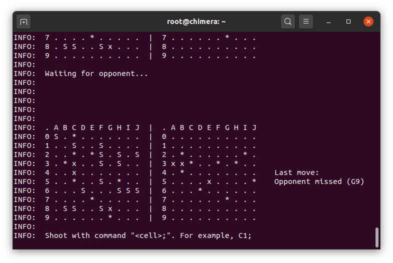

# SQL Battleships



Articles:
- https://selectel.ru/blog/seabattle-postgresql/
- https://habr.com/ru/company/selectel/blog/519010/

## Requirements 

- postgresql 12.4
- docker (optional)

## Running server in docker

```
docker build -t sql-battleships .
docker run -p 5432:5432 sql-battleships
``` 

## Starting the game

```
psql -U postgres <<<'call screen_loop()' & psql -U postgres
```